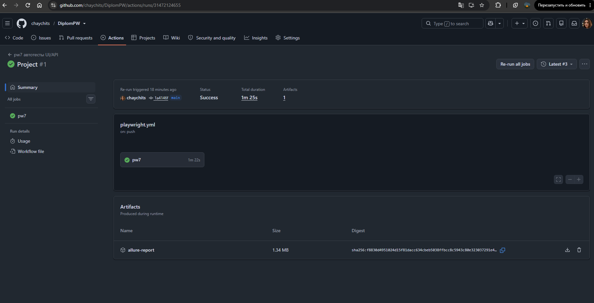
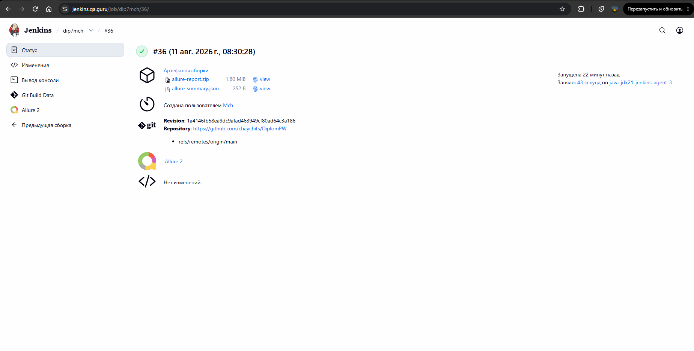
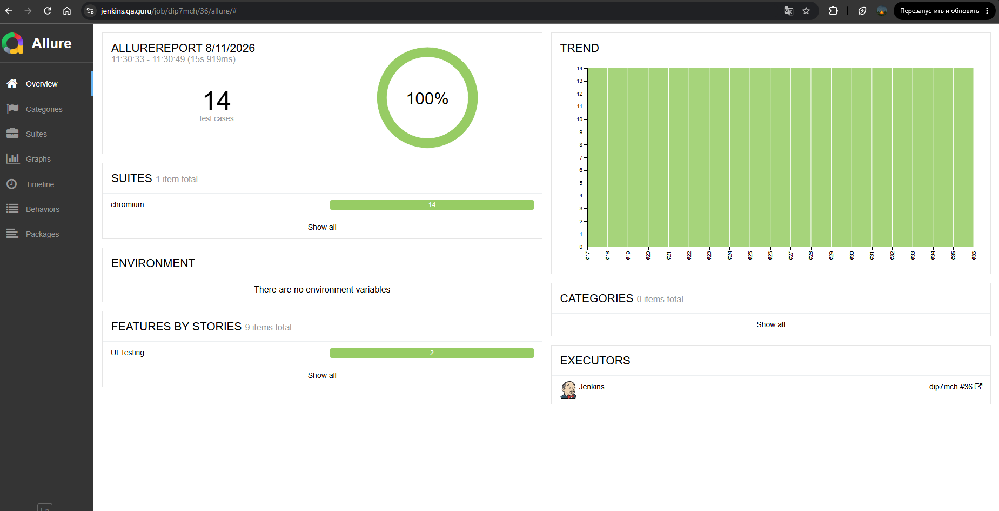
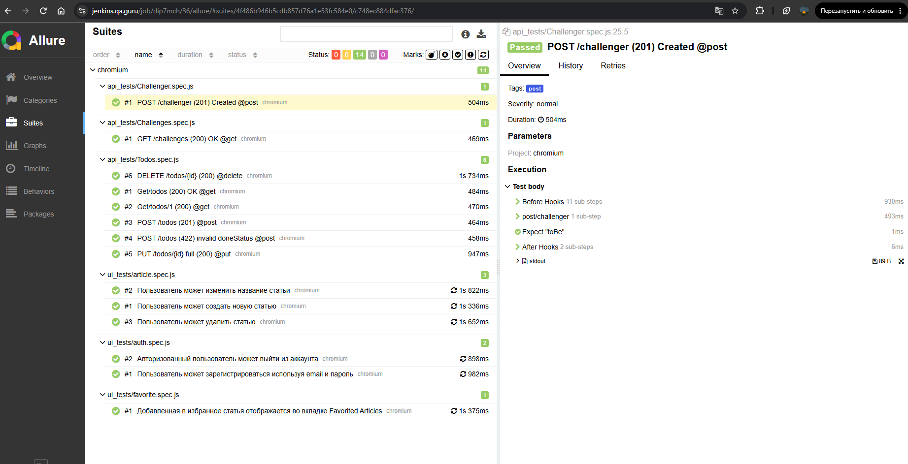
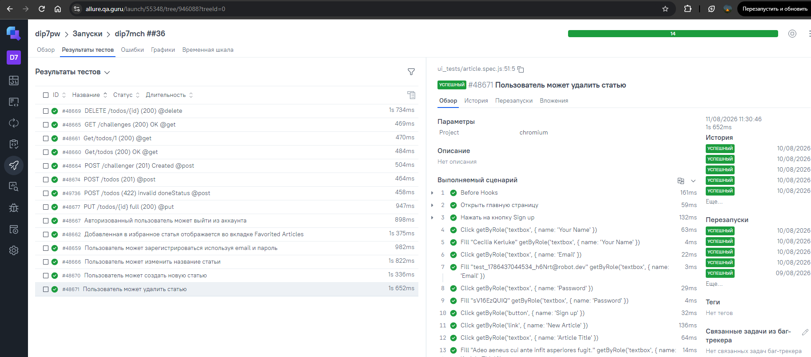
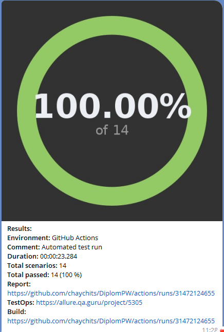

# 🎓 DiplomPW

## 📌 О проекте

**DiplomPW** — дипломный проект по автоматизации тестирования веб-приложения с использованием **JavaScript + Playwright**.
Основная цель проекта — создать не набор отдельных тестов, а **масштабируемый тестовый фреймворк**, который можно расширять новыми UI и API сценариями без дублирования кода.

---

# 🎯 Цели проекта

В рамках проекта реализованы:

* ✅ UI автоматизация;
* ✅ API автоматизация;
* ✅ Page Object Model;
* ✅ Facade Pattern;
* ✅ Fixture-based архитектура;
* ✅ Builder Pattern;
* ✅ генерация тестовых данных через Faker;
* ✅ Allure Report;
* ✅ Allure TestOps;
* ✅ GitHub Actions;
* ✅ Jenkins;
* ✅ Telegram Notifications;
* ✅ хранение секретов через environment variables;
* ✅ разделение UI и API тестов;
* ✅ единая структура проекта для дальнейшего расширения.

---

# 🧪 Тестируемое приложение

### 🖥️ UI

https://realworld.qa.guru/

### 🔌 API

https://apichallenges.eviltester.com

---

# 📁 Структура проекта
```
DiplomPW/
│
├── .github/
│   └── ...
│
├── notifications/
│   └── ...
│
├── screenshots/
│   └── ...
│
├── src/
│   ├── builders/
│   ├── fixtures/
│   ├── pages/
│   ├── services/
│   └── index.js
│
├── tests/
│   ├── api_tests/
│   │   ├── Challenger.spec.js
│   │   ├── Challenges.spec.js
│   │   └── Todos.spec.js
│   │
│   └── ui_tests/
│       ├── article.spec.js
│       ├── auth.spec.js
│       └── favorite.spec.js
│
├── .env.example
├── .gitignore
├── package.json
├── package-lock.json
├── playwright.config.js
└── README.md
```
---

# ⚙️ Установка

1. Клонирование проекта  - git clone https://github.com/chaychits/DiplomPW.git

2. Установка зависимостей - npm ci

3. Установка браузера Chromium - npx playwright install chromium


# 🔐 Переменные окружения

Секретные данные не хранятся непосредственно в исходном коде.

Пример переменных находится в:  .env.example

Секреты хранятся в соответствующих настройках CI/CD.

---

# ▶️ Запуск тестов

Все тесты - npx playwright test

UI-тесты - npx playwright test tests/ui_tests

API-тесты - npx playwright test tests/api_tests

Запуск в UI Mode - npm run ui

Запуск с HTML Report - npx playwright show-report

# 🔄 CI/CD
В проекте реализована интеграция с двумя CI/CD системами.

## 🐙 GitHub Actions
Тесты запускаются автоматически при push в main, создании Pull Request и вручную через Run workflow.


## 🔧 Jenkins
Тесты запускаются через Build now с последующей генерацией Allure Report.


# 📊 Allure Report
После выполнения тестов формируется Allure Report с результатами UI и API тестирования.



# ☁️ Allure TestOps
Результаты тестирования автоматически отправляются в **Allure TestOps**.


# 🤖 Telegram Notifications
После выполнения тестов формируется уведомление в Telegram.




---

